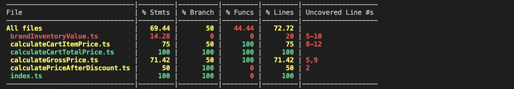

# Action Item : Integration Testing :bowling:

In this **Action Item**, you will:
- :hamster: write `integration tests` to cover an entire module without testing every method/function
- 🎭 focus on `external interfaces` and write tests decoupled from implementation details
- :hammer: use specialized libraries to generate `mocks` for objects or functions

**Note: The difficulty increases gradually, and we recommend you complete the items in the given order.**

------
### :notebook_with_decorative_cover:Tips for effective test writing:

1. It is ok to repeat yourself(forget **DRY**) and be **DAMP**(Descriptive and Meaningfully Phrases)
2. Write Clear error messages: **Given -> When -> Then**
3. **Test the external API of a module, not the implementation details**

------

##### 1.1 Install dependencies:
In your terminal:
```bash
npm install
```
##### 1.2 Run the tests:
```bash
npm test
```
Check the terminal and inspect the code coverage:


### 1.`EASY` Extend the integration tests to 80% code coverage 
Check the examples in the test file:

- [priceCalculator.spec.ts](src/tests/priceCalculator.spec.ts)

##### TODO's:
- 📝 Complete the tests in [priceCalculator.spec.ts](src/tests/priceCalculator.spec.ts) to get the code coverage to **`80%`** for the module

------

### 2.`HARD` Extend the integration tests to 100% code coverage 

##### TODO's:
- 📝 Get the code coverage to **`100%`** for the module by adding tests in [priceCalculator.spec.ts](src/tests/priceCalculator.spec.ts)

HINT: Instead of manually building your mocks, use `ts-auto-mock` to generate objects automatically.
```bash
npm install ts-auto-mock --devOnly=true
```
See the [full docs here](https://typescript-tdd.github.io/ts-auto-mock/installation).

------


### Getting Help 
If you have issues with the Action Item, you can ask for help in the [Community](https://community.codewithdragos.com/) or, in the [Weekly Calls](https://calendar.google.com/calendar/u/0?cid=Y19kbGVoajU1Z2prNXZmYmdoYmxtdDRvN3JyNEBncm91cC5jYWxlbmRhci5nb29nbGUuY29t).

### Made with :orange_heart: in Berlin by @CodeWithDragos
